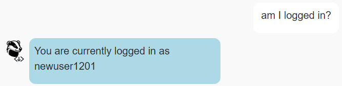

# BadgerChat (with Voice!)

BadgerChat was developed using HTML, CSS, JavaScript, React Native, Node.js, Wit.AI, and Sketch. It features a versatile chat agent built on React that manages both text and voice inputs, capable of executing various commands like user authentication and message posting. The integration of Wit.AI enhances the system's ability to understand and interpret user intentions from both text and voice inputs. Furthermore, BadgerChat supports real-time interactions by fetching and posting chat messages efficiently, while a custom-built delegation system maintains meticulous control over user sessions and preferences. 🥳🎉 

**Please Note:** The speech-to-text transcription and text-to-speech synthesis are just for fun! 

## Setup

Generated using [vite](https://vitejs.dev/guide/). Furthermore, [bootstrap](https://www.npmjs.com/package/bootstrap) and [react-bootstrap](https://www.npmjs.com/package/react-bootstrap) have been installed. **You should *not* re-run the  npm create vite command**. Instead, in this directory, simply run...

```bash
npm install
npm run dev
```

Then, in a browser, open `localhost:5173`. 

## API Notes

All routes are relative to `https://cs571.org/api/s24/hw11/`

 - **This API uses *cookies* for authentication.**
 - **This API does NOT paginate messages *nor* is a chatroom name required.**
   - Instead, a `chatroom` and max `num` of posts (up to 10) may optionally be specified.

See `API_DOCUMENTATION.md` for full details.

| Method | URL | Purpose | Return Codes |
| --- | --- | --- | --- |
| `GET`| `/chatrooms` | Get all chatrooms. | 200, 304 |
| `GET` | `/messages?chatroom=NAME&num=NUM`| Get latest `NUM` messages for specified chatroom. | 200, 400, 404 |
| `POST` | `/messages?chatroom=NAME` | Posts a message to the specified chatroom. | 200, 400, 404, 413 |
| `DELETE` | `/messages?id=ID` | Deletes the given message. | 200, 400, 401, 404 |
| `POST` | `/register` | Registers a user account. | 200, 400, 409, 413  |
| `POST` | `/login` | Logs a user in. | 200, 400, 401 |
| `POST` | `/logout` | Logs the current user out. | 200 |
| `GET` | `/whoami` | Gets details about the currently logged in user. | 200 |

**When making API calls with a request body, don't forget to include the header `"Content-Type": "application/json"`**

## BadgerMart

### 1. `Help`

Type along the lines of "help", "get help", or "what can I do" should trigger the chat agent to prompt user for assistance.


### 2. `See all Chatrooms`

Type along the lines of "chatrooms", "what chatrooms are there", or "what chatrooms can I use" should trigger this intent.

Then, when this is triggered, the agent should respond with the full list of chatrooms.


### 3. `See latest posts/messages`

Type along the lines of "messages", "give me the 4 latest posts", or "what are the 4 latest posts in Union South Socials" should trigger this intent.

Then, when this intent is triggered, the agent should respond with the latest X messages for Y chatroom as *consecutive responses*.

Note that both X and Y are optional, meaning any number for X and any chatroom for Y. If the number is omitted, assumed that it is 1. If the chatroom is omitted, assume that it is the latest overall posts across all chatrooms. 


### 4. `Login`

Type along the lines of "login", "log in", or "log me in" should trigger this intent.

Then, when this intent is triggered, the agent should first check if the user is currently logged in. If the user is currently logged in, the agent informs them that need to be logged out before logging in. Otherwise, the agent will *follow up* to collect the user's username and password. Upon a successful login, the user will be informed that they were successfully logged in, otherwise that their username and password combination was incorrect.


### 5. `Register`

Type along the lines of "register", "sign me up", or "I want an account" should trigger this intent.

Then, when this intent is triggered, the agent will first check if the user is currently logged in. If the user is currently logged in, the agent will inform them that need to be logged out before registering. Otherwise, the agent will  *follow up* to collect the user's username, password, and confirm their password. If the repeated password does not match the original password, the registration process should be cancelled. Furthermore, upon registration, if the username has already been taken, the user should be informed as such. Otherwise, the user should be informed that they were successfully registered and logged in.


### 6. `Who am I?`

Type along the lines of "am I logged in", "who am I", or "who am I logged in as" should trigger this intent.

Then, when this intent is triggered, if the user is not logged in, the user will be informed that they are not logged in. Otherwise, they will be told what their username is.




### 7. `Logout`

Type along the lines of "logout", "log out", or "log me out" should trigger this intent.

Then, when this intent is triggered, the agent will first check if the user is currently logged in. If the user is *not* currently logged in, the agent will inform them that need to be logged in before logging out. Otherwise, the agent should log the user out and inform them as such.


### 8. `Create a message/post`

Type along the lines of "create a post", "make a post in union south socials", or "post a message to picnic point pathfinders" should trigger this intent.

Then, when this intent is triggered, the agent will first check if the user is currently logged in. If the user is *not* currently logged in, the agent will inform them that need to be logged in before creating a post. Additionally, a chatroom name **must** be specified. If the user fails to specify a chatroom name, inform them that they *must* specify a chatroom to post in. 

If the user is logged in and has specified a chatroom name, the agent will *follow up* to collect the title and content of the post. After collecting the title and content, the agent should do a final confirmation with the user. If a user confirms that they would like to create the post, a post will be made in the specified chatroom and the agent should inform the user as such. Otherwise, if the user fails to confirm the posting, the agent will *not* post the message and assure the user that the post has not been made.


